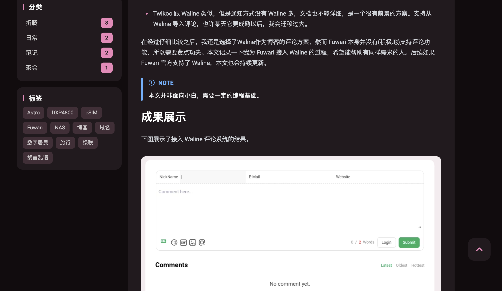

# 前言

fuwari自带了一个目录组件，你可以在 `src/config.ts`中启用。

```typescript
	toc: {
		enable: true, // Display the table of contents on the right side of the post
		depth: 2, // Maximum heading depth to show in the table, from 1 to 3
	},
```

但默认的效果并不理想，你大概率看不见它：



可谓是王不见王。


它去哪儿了呢？你得把页面缩小 `ctrl - `才能看见


考虑到左边的sidebar有一大片空间，放右边确实是个有点奇怪的选择。

# 配置

:::warning[有bug]
这样做会使得平滑效果消失，详情请见下文
:::

去 `src/layouts/MainGridLayout.astro`把原来的目录删掉。

```astro

            <SideBar class="mb-4 row-start-2 row-end-3 col-span-2 lg:row-start-1 lg:row-end-2 lg:col-span-1 lg:max-w-[17.5rem] onload-animation" headings={headings}></SideBar>

            <main id="swup-container" class="transition-swup-fade col-span-2 lg:col-span-1 overflow-hidden">
                <div id="content-wrapper" class="onload-animation">
                    <!-- the overflow-hidden here prevent long text break the layout-->
                    <!-- make id different from windows.swup global property -->
                    <slot></slot>
                    <div class="footer col-span-2 onload-animation hidden lg:block">
                        <Footer></Footer>
                    </div>
                </div>
            </main>

            <div class="footer col-span-2 onload-animation block lg:hidden">
                <Footer></Footer>
            </div>
        </div>

        <BackToTop></BackToTop>
    </div>
</div>

<!-- The things that should be under the banner, only the TOC for now -->
<!-- <div class="absolute w-full z-0 hidden 2xl:block">
    <div class="relative max-w-[var(--page-width)] mx-auto">
         #TOC component 
        {siteConfig.toc.enable && <div id="toc-wrapper" class:list={["hidden lg:block transition absolute top-0 -left-[var(--toc-width)] w-[var(--toc-width)] items-center",
            {"toc-hide": siteConfig.banner.enable}]}
        >
            <div id="toc-inner-wrapper" class="fixed top-14 w-[var(--toc-width)] h-[calc(100vh_-_20rem)] overflow-y-scroll overflow-x-hidden hide-scrollbar">
                <div id="toc" class="w-full h-full transition-swup-fade ">
                    <div class="h-8 w-full"></div>
                    <TOC headings={headings}></TOC>
                    <div class="h-8 w-full"></div>
                </div>
            </div>
        </div>}

         #toc needs to exist for Swup to work normally 
        {!siteConfig.toc.enable && <div id="toc"></div>}
    </div>
</div> -->
</Layout>
```

然后把 `src/components/widget/SideBar.astro`改成这样。

```astro
---
import { siteConfig } from "@/config";

import type { MarkdownHeading } from "astro";
import Categories from "./Categories.astro";

import Profile from "./Profile.astro";
import Tag from "./Tags.astro";
import TOC from "./TOC.astro"; // 1. 导入 TOC 组件

interface Props {
	class?: string;
	headings?: MarkdownHeading[];
}
const { headings = [] } = Astro.props;
const className = Astro.props.class;
---
<div id="sidebar" class:list={[className, "w-full"]}>
    <div class="flex flex-col w-full gap-4 mb-4">
        <Profile></Profile>
    </div>
    <div id="sidebar-sticky" class="transition-all duration-700 flex flex-col w-full gap-4 top-4 sticky top-4">
        <Categories class="onload-animation" style="animation-delay: 150ms"></Categories>
        <Tag class="onload-animation" style="animation-delay: 200ms"></Tag>
        <TOC headings={headings}></TOC>
    </div>
</div>
```

完成。


### PS

这样添加目录似乎会使得fuwari的平滑变化的效果失效，就是跳转页面的时候不刷新整个页面的效果。问了问gemini，修复了这个问题。

问题的来源总的来说，是因为fuwari使用了 **Swup.js** 库来实现页面间的平滑过渡，而不是传统的整页刷新。swup根据容器的id刷新容器的内容。所以在添加组件时保持容器的id。

对于 `src/layouts/MainGridLayout.astro`，要保留一个空组件。

```html
<!-- The things that should be under the banner, only the TOC for now -->
<!-- 添加下面这个空的、隐藏的 div 来让 Swup 正常工作 -->
<div id="toc" class="hidden"></div>
</Layout>

```

对于 `src/components/widget/SideBar.astro`，要添加一个带id的容器。

```html
<div id="sidebar" class:list={[className, "w-full"]}>
    <div class="flex flex-col w-full gap-4 mb-4">
        <Profile></Profile>
    </div>
    <div id="sidebar-sticky" class="transition-all duration-700 flex flex-col w-full gap-4 top-4 sticky top-4">
        <Categories class="onload-animation" style="animation-delay: 150ms"></Categories>
        <Tag class="onload-animation" style="animation-delay: 200ms"></Tag>
        <!-- 套一个id为toc的容器，让swup可以刷新局部 -->
        <div id="toc">
            <TOC headings={headings}></TOC>
        </div>
    </div>
</div>
```

平滑效果就恢复了。
