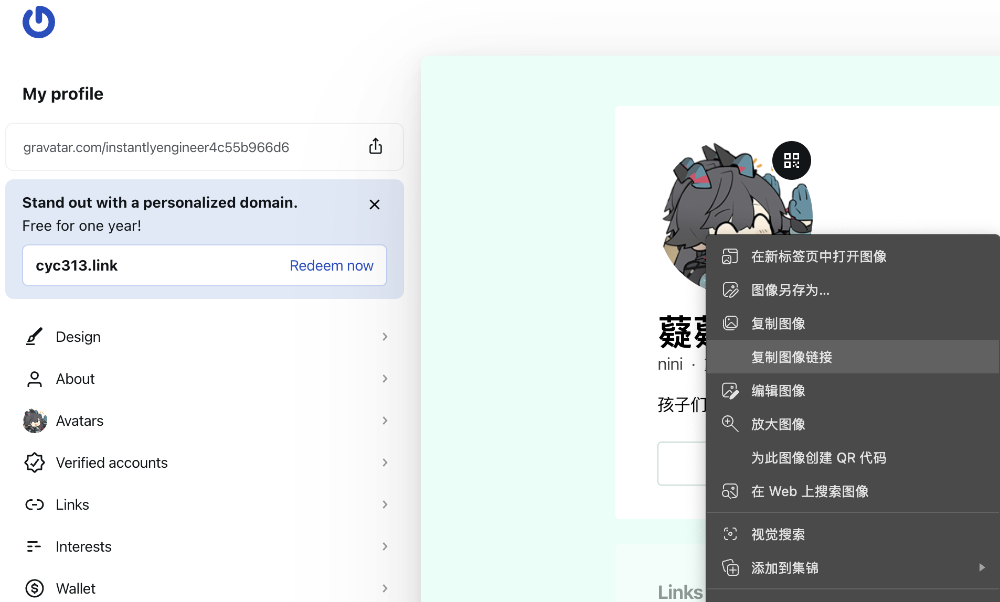

如果你看见了这一篇文章，那么可喜可贺，这说明这个小网站已经结束了刀耕火种的开发阶段，可以承载一些内容的发布了。作为这个网站的第一篇文章，趁着我对诸多细节还记忆较深，不如先聊聊，这个网站是如何搭建的，它用了哪些技术栈，又参考了哪些类似项目？如果你也想做一个类似的个人网站，我想这些经验会对你有些帮助。

但在我们深入到硬核的技术细节之前，让我们先去回答一个灵魂问题。

# 在这个短视频的时代，为什么你还需要一个博客？

从我个人的角度出发，个人博客能实现这些需求。

- 跨平台链接：我想要一个个人主页，将自己在各个平台的账号链接起来，以便在A平台认识我的人可以轻易地在B平台找到我。
- 个人简历：考虑到鄙人大概率还会有一段研究牲的生涯，那么按照学术圈的规矩，我大概是需要有一个个人主页，介绍一下自己的研究领域，发表论文，教育背景什么的。可以吸引一下潜在的合作者。
- 技术文章分享：总所周知，程序员写代码的时候会查很多资料（至少在gpt出来前是这样的），资料多了就需要整理归纳，这个过程必然就会产生文档。其实这些文档稍加加工就可以变成技术文章了，那既然写都写了，难道不找个地方发一发？

当然，其实这些需求并不都需要你有一个个人网站才能实现，例如链接账号的需求可以通过 [linktr](https://linktr.ee/)实现。学者们有的也会选择就使用学校官网或者谷歌学术的个人页，不再自建网站。至于分享一些技术文章的需求，知乎，简书，博客园一众内容平台都可以实现，而且这些内容平台还有内部的推荐算法，可以主动的把你的文章推送给潜在的观众，给你的内容带来远超搜索引擎的曝光。

这些开箱即用的方案可以实现绝大多数人对一个博客的想象，但是，自建网站的方案相对于它们仍然有不可替代的优势，数据安全和灵活性。

### 数据安全

说是数据安全，其实也并没有那么安全，总有人能下掉你的内容的，不说一些不能说的，就是国际上那个域名管理的组织，其实也有权利收回你的域名的，如果你真的用博客网站干出了违背全人类利益的事情（不过那得是什么神人才能做到的事情？）。但是，相比于知乎，博客园等平台，个人网站在被ban之后至少还能留下一个本地的git仓库，换个域名和托管就能东山再起。这样你的文章就不会和平台绑定在一起。

## 灵活性

你说，有没有一种可能，未来的我想要在博客里添加一些视频，3d内容甚至交互小游戏呢？这些内容可以很轻松的通过浏览器分享，但在社交媒体上就没那么容易了。

# 2025年了，自建博客有什么选择？

其实我一直觉得，我是不是在技术选型上花费了太多的时间了，等我确定了用什么框架，别人似乎主题都自己手搓完了，不过，反正做都做了，我决定还是把他们好好的写下来，希望对你有所帮助。

大体来说，网站的技术选择主要考虑两个因素，你有多少💰买服务器？你有多少代码定制的能力？


## 满血动态网站流

如果你恰巧财力雄厚，那么你可以考虑部署一个满血的动态网站，即带有后端和前端，有丰富功能的网站app。这些网站的后端可以用任何语言写，java，rust，python。你可以自由（？）选择自己喜欢的语言实现业务逻辑。

但是，写代码的时候有多自由，部署的时候就有多窘迫，目前大多数的docker网站都是按量付费，一年下来大概得要个三五百块。也是因此，笔者放弃了这个方案，但对于有点预算的朋友可以考虑。毕竟就算这样，docker也比vps要便宜的多了。对于动态网页部署的平台，下表可以参考。

| 平台                                                                                             | 价格 | 备注                                                                                                                                                                                                                            |
| ------------------------------------------------------------------------------------------------ | ---- | ------------------------------------------------------------------------------------------------------------------------------------------------------------------------------------------------------------------------------- |
| [sealos](https://sealos.run/)                                                                       | 低   | 不知道为什么halo没跑起来，介绍可以看[原子能的视频](https://www.bilibili.com/video/BV1sXjnzxE4p)                                                                                                                                    |
| [爪云](https://run.claw.cloud/)                                                                     | 低   | sealos改的，提供了免费的套餐，我一样没把halo跑起来，可以看[爬爬虾的视频](https://www.bilibili.com/video/BV1zKVtzFEQH)介绍                                                                                                          |
| [zeabur](https://zeabur.com/)                                                                       | 较低 | 提供了中文界面，但内存较贵。                                                                                                                                                                                                    |
| vps                                                                                              | 高   | 头一年99，第二年直接上千，没有这个必要。                                                                                                                                                                                        |
| [cloudflare tunnel](https://developers.cloudflare.com/cloudflare-one/connections/connect-networks/) | 低？ | 当然，你可以用自己的设备搭配内网穿透来建站，笔者曾经也用过这种方案。<br />但你能接受每次给家里换个灯泡就要来一次服务器断电下线的运维事故吗？<br />而且如果要让网站在国内访问更正常一点，你还需要手动配置cdn，这据说需要两个域名 |

### [halo](https://www.halo.run/ "官网")

halo是一个完整的博客方案，别说深色，多语言，他甚至AI，seo，都给你写好了。用它你可以不写代码，后台点点点就行了，丰富的插件和主题生态也很方便，如果你愿意充一点钱，代码都不用写就能自动备份。适合一些想要花钱省时间的朋友。

### WordPress

太老了，我一个喜新厌旧的人根本不想用。

### 自研

如果你有时间，你确实可以自己写一个，那就写吧写吧，别人选景点你选数据库，别人过黄金周你过大小周，她说她去了拉萨见了雪，你说你学了three.js和GSAP。她说她在藏区怎么克服的高反，你说你用flutter web 怎么做的seo。管他的呢，写的观棋烂柯，马齿徒增，写的岁月无情催人老，可怜白发生！

## 静态网站--其实也不那么静态

### 前端托管

其实一个有评论区的博客，也不是严格意义上的静态网站了，这里说的静态网站，其实是指jamstack，按我的理解就是静态网页加云函数加上baas（后端即服务）。对于部署，主要就是[netlify](https://www.netlify.com/)和[vercel](https://vercel.com/)。我选netlify主要因为两点：

* vercel.app域名[据说被墙了](https://kuizuo.me/docs/docusaurus-deploy/)
* vercel最近[在next.js上的大活](https://www.bilibili.com/video/BV1uCdUYPE6R)给人印象不好

其实都不是很强的理由，二者的区别并不大。

### 后端托管

由于netlify没有提供后端托管，我们参照[waline的文档](https://waline.js.org/guide/get-started/)配置了leancloud。国外或许firebase用的更多。

### 框架选择

笔者注意到项目文件结构的差异，将框架分为两种，开发优先和主体优先。可以这么理解，开发优先的框架默认用户可以吃透你所用的主题，不提供一个对主题的封装，当你使用的主题更新了新功能时，你需要手动用git同步上游的更新。这意味着如果你对你使用的主题做了一些配置，那么你不能自动的获得更新，需要自己merge。而另一种，则往往会将主题文件放在项目的一个文件夹里，你可以用命令一键更新。这意味着它默认你是用多于写的。笔者虽然目前还是用多于写，但~~死要面子活受罪~~为了战未来，还是选择了一个开发优先的框架。以下是笔者考虑过的一系列框架。

#### 开发优先

##### [astro](https://astro.build/)

如你所见，笔者最后选择的astro，优点如下：

| 特点                                  | 评价                                         |
| ------------------------------------- | -------------------------------------------- |
| 不限制在一个前端框架，灵活度高        | 战未来，现在还是用别人的                     |
| 可以和多个cms（内容管理系统）方案集成 | 个人博客就一个人写，感觉没必要，obsidian足矣 |
| 1.0发布于2021年                       | 就喜欢年纪小的😍                             |

#### [flutter](https://flutter.cn/)

作为可以说是下一代qt的前端框架，flutter的优点很明显：

* 全平台可用
* 内建[material design](https://m3.material.io/)组件，material design 天下第一！
* 没有js
* 官方firebase支持

但对于2025年的个人博客，flutter的缺点也很明显：

* 谷歌对flutter进行了裁员，如今更新较慢
* flutter优先考虑交互性，而不是内容优先，[在web平台下对于搜索引擎不够友好](https://docs.flutter.dev/platform-integration/web/faq)。

#### next.js

感觉不如astro

### 主题优先

#### [hugo](https://gohugo.io/)

* 用go语言写的，总体比较新
* [blowfish](https://blowfish.page/)这个主题很漂亮，内建了i18n支持，但自己配置的时候发现有点货不对板，我动画背景呢？

#### [hexo](https://hexo.io/zh-cn/)

* 有插件生态
* 有一个[明日方舟主题](https://arknights.theme.hexo.yue.zone/)，内建评论区支持

#### [zola](https://www.getzola.org/)

* 你说得对，但是Rust是由Mozilla自主研发的一款全新内存安全编程语言。编译将发生在一个被称作「卡尔构」的构建系统，在这里，被引用的指针将被授予「生命周期」，导引安全之力。你将扮演一位名为「开发者」的神秘角色在编程的搏斗中邂逅骨骼惊奇的报错，绕开它们通过编译同时，逐步发掘「Rust」的真相。
* 据说模版相对于hugo更好用，虽然我连模版是什么都不知道。

# 百尺竿头更进一步

笔者对这个网站还是有美好的期待，目前有些功能已经落实，有些就要等到下次了。

## 评论区

评论组件选择了waline，选他的主要原因是它有文章反应功能，我选择时参考了[没有秃头基因的燊](https://yzs020220.github.io/posts/44102/)的博客（怎么感觉这样叫陌生人的网名是不是有点尴尬）。

然后参考的[幽幽子的这篇博客](https://iuuko.com/posts/tinker/fuwari-waline-comments/)配置了waline，照着做一遍过，祂写的很详细，唯一不太清晰的可能是评论区的插入位置，这里放出相对更完整的位置。

```astro

            <!-- always show cover as long as it has one -->

            {entry.data.image &&
                <ImageWrapper id="post-cover" src={entry.data.image} basePath={path.join("content/posts/", getDir(entry.id))} class="mb-8 rounded-xl banner-container onload-animation"/>
            }


            <Markdown class="mb-6 markdown-content onload-animation">
                <Content />
            </Markdown>

            {licenseConfig.enable && <License title={entry.data.title} slug={entry.slug} pubDate={entry.data.published} class="mb-6 rounded-xl license-container onload-animation"></License>}

        </div>
    </div>

    <div class="flex flex-col md:flex-row justify-between mb-4 gap-4 overflow-hidden w-full">
        <a href={entry.data.nextSlug ? getPostUrlBySlug(entry.data.nextSlug) : "#"}
           class:list={["w-full font-bold overflow-hidden active:scale-95", {"pointer-events-none": !entry.data.nextSlug}]}>
            {entry.data.nextSlug && <div class="btn-card rounded-2xl w-full h-[3.75rem] max-w-full px-4 flex items-center !justify-start gap-4" >
                <Icon name="material-symbols:chevron-left-rounded" class="text-[2rem] text-[var(--primary)]" />
                <div class="overflow-hidden transition overflow-ellipsis whitespace-nowrap max-w-[calc(100%_-_3rem)] text-black/75 dark:text-white/75">
                    {entry.data.nextTitle}
                </div>
            </div>}
        </a>

        <a href={entry.data.prevSlug ? getPostUrlBySlug(entry.data.prevSlug) : "#"}
           class:list={["w-full font-bold overflow-hidden active:scale-95", {"pointer-events-none": !entry.data.prevSlug}]}>
            {entry.data.prevSlug && <div class="btn-card rounded-2xl w-full h-[3.75rem] max-w-full px-4 flex items-center !justify-end gap-4">
                <div class="overflow-hidden transition overflow-ellipsis whitespace-nowrap max-w-[calc(100%_-_3rem)] text-black/75 dark:text-white/75">
                    {entry.data.prevTitle}
                </div>
                <Icon name="material-symbols:chevron-right-rounded" class="text-[2rem] text-[var(--primary)]" />
            </div>}
        </a>
    </div>
	<!-- 我放的这儿 -->
    <Comment post={entry}></Comment>

</MainGridLayout>

```

虽然不知道为什么大佬后来换成artalk了。

如果你选择用twikoo的话可以看看[zokiio](https://blog.tantalum.life/posts/add-comments-to-fuwari-with-twikoo/)的博客，写的比较详细，但我没有验证，祂还做了个挺好看的鼠标点击效果，感兴趣的可以去看看。

然后参考了官方文档，进行了一些配置。

* 文章反应，waline独占功能，不可能不用。
* 没有配置人机验证，我打算等我被爬虫攻击了再说。
* 邮件通知，按理来说应该配置好了，不过还需要有缘人来帮我测试一下。
* 默认头像，参考这个[issue](https://github.com/orgs/walinejs/discussions/1781)。不过似乎这几年[gravatar](https://gravatar.com/)的ui变了太多了，设置完头像后我直接用右键找的头像链接。



最终修改后的 `src/components/comment/Waline.astro`如下：

```astro
---
import { commentConfig, siteConfig } from "@/config";

interface Props {
	path: string;
}

const configHue = siteConfig.themeColor.hue; // 获取配置的 hue

const config = {
	...commentConfig.waline,
	el: "#waline",
	path: Astro.props.path,
	dark: "html.dark",
	wordLimit: ["1", "300"],
	reaction: [
		"http://unpkg.com/@waline/emojis@1.2.0/tw-emoji/1f92f.png", //崇拜
		"http://unpkg.com/@waline/emojis@1.2.0/tw-emoji/1f923.png", //欢乐
		"http://unpkg.com/@waline/emojis@1.2.0/tw-emoji/1f9d0.png", //有用
		"http://unpkg.com/@waline/emojis@1.2.0/tw-emoji/1f605.png", //鄙视
		"http://unpkg.com/@waline/emojis@1.2.0/tw-emoji/1f92e.png", //恶心
		"http://unpkg.com/@waline/emojis@1.2.0/tw-emoji/1f92c.png", //愤怒
		"http://unpkg.com/@waline/emojis@1.2.0/tw-emoji/1f634.png", //无聊
	],
	emoji: [
		"//unpkg.com/@waline/emojis@1.2.0/weibo",
		"//unpkg.com/@waline/emojis@1.2.0/bmoji",
		"//unpkg.com/@waline/emojis@1.2.0/tw-emoji",
		"//unpkg.com/@waline/emojis@1.2.0/tieba",
		"//unpkg.com/@waline/emojis@1.2.0/qq",
		"//unpkg.com/@waline/emojis@1.2.0/bilibili",
		"//unpkg.com/@waline/emojis@1.2.0/alus",
		"//unpkg.com/@waline/emojis@1.2.0/soul-emoji",
	],
};
---
<!-- Waline -->
<div class="relative w-full">
  <div id="waline"></div>
  <link rel="stylesheet" href="https://unpkg.com/@waline/client@v3/dist/waline.css" />

  <!-- 定义 CSS 变量，传递 hue 值 -->
  <style define:vars={{ configHue }}>
    #waline {
      --waline-theme-color: oklch(75% 0.33 var(--configHue));
      --waline-active-color: oklch(80% 0.33 var(--configHue));
    }
  </style>
  
  <script type="module" is:inline define:vars={{ config }}>
    import { init } from 'https://unpkg.com/@waline/client@v3/dist/waline.js';
    init(config);
  </script>
</div>
```

## i18n

放弃了，感觉个人博客不太能有能力为每篇内容实现多语言版本，要考虑多语言的地方极少，直接做成多个页面就行了。

## 🚧施工中

- [ ] 用shader实现好看的动态背景。
- [ ] 后台流量统计
- [ ] 分类和文件夹能不能统一？
